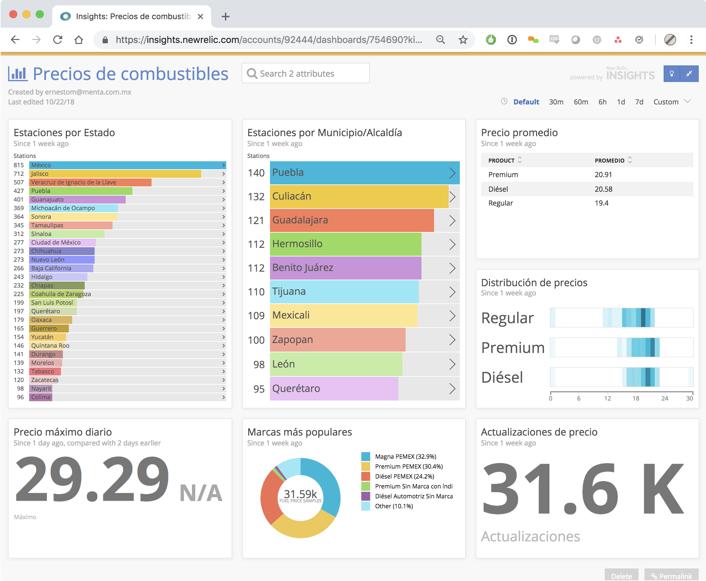

# Mexican Fuel Prices Analysis with Python and New Relic Insights

This is a useful proof of concept of what can be done with New Relic Insights.

### How this works

- The script gets the daily pricing report from the official API from [Comisión Reguladora de Energía](https://www.gob.mx/cre), for each location in each state in the country.
- Then it uploads the pricing information to New Relic Insights using [custom events](https://docs.newrelic.com/docs/insights/insights-data-sources/custom-data/insert-custom-events-insights-api).
- The uploaded information should be beautifully exposed through an Insights dashboard.

## Requirements

- A New Relic [Account](https://www.menta.com.mx/servicios/inteligencia-de-datos).
- A New Relic Insights [Insert Key](https://docs.newrelic.com/docs/insights/insights-data-sources/custom-data/insert-custom-events-insights-api#register).
- A New Relic [Account ID](https://docs.newrelic.com/docs/accounts/install-new-relic/account-setup/account-id).

## Play around

- Download or clone this repo.
- Get ready the requirements described above.
- Run `make data`, which will:
- - make sure your virtual environment exists.
- - make sure your environment variables are set up.
- - download the data in pickle files.
- - upload it to New Relic Insights.

